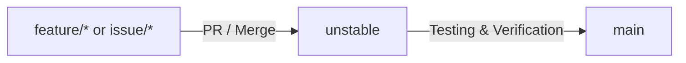

# Developer Workflow and Git Guidelines

This document outlines the branching strategy, branch naming conventions, and release process for the FriendlyFire repository. All developers and AI agents must follow these instructions.

---

## 1. Branch Naming Conventions

Do **NOT** prefix branches with `antigravity/` or similar agent-specific namespaces. Instead, use clean and descriptive names aligned with features or issues:
- **Feature Branches**: `feature/<feature-name>` (e.g., `feature/starboard`)
- **Issue Branches**: `feature/issue-<number>-<description>` or `issue/<number>-<description>` (e.g., `feature/issue-73-starboard`)
- **Bug Fix Branches**: `fix/<description>` (e.g., `fix/quote-image-timeout`)

---

## 2. Pull Request Target Base Branch

- All Pull Requests must target the **`unstable`** branch.
- **Do not** target `main` directly for features or bug fixes.

---

## 3. Merging and Release Cycle

1. **Development**: Create a branch off `unstable`, make changes, and open a Pull Request targeting `unstable`.
2. **Integration**: Merge the PR into `unstable`.
3. **Testing**: Run tests, deploy, and verify stability using the `unstable` branch.
4. **Release**: Once fully validated and verified, `unstable` is merged into `main` by the repository owner.

---

## 4. Development Workspace

For development and agent environments, use the generic worktree directory:
- Path: `C:\Users\clement.fazilleau\.gemini\antigravity\worktrees\FriendlyFire\workspace`
